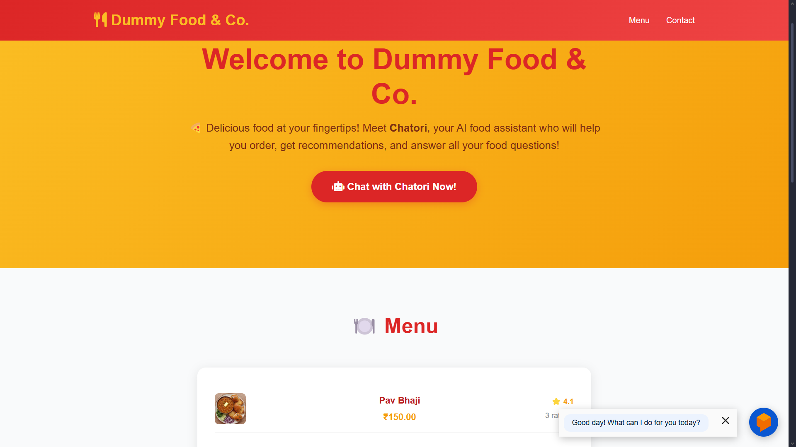
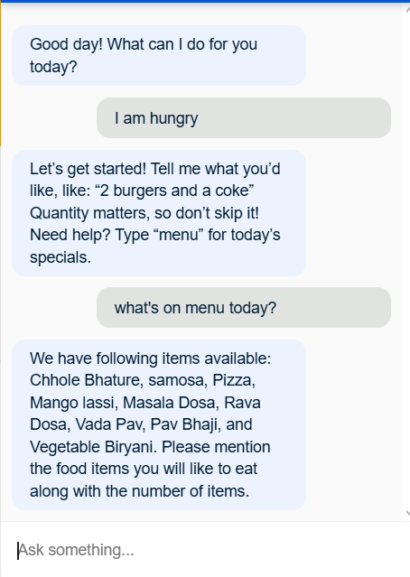
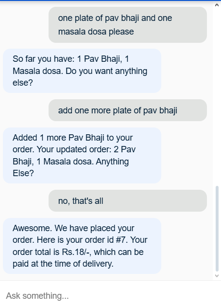
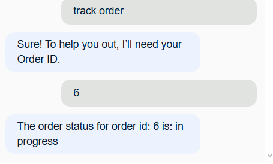
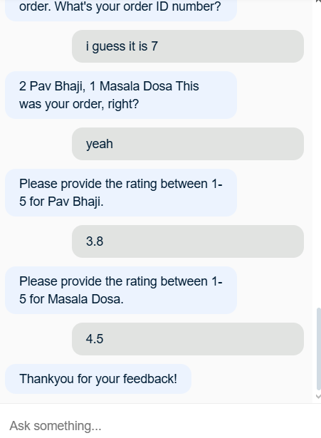
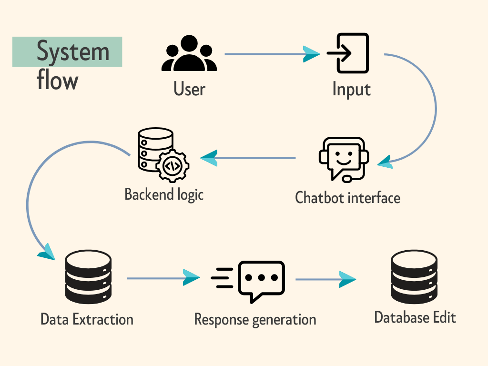
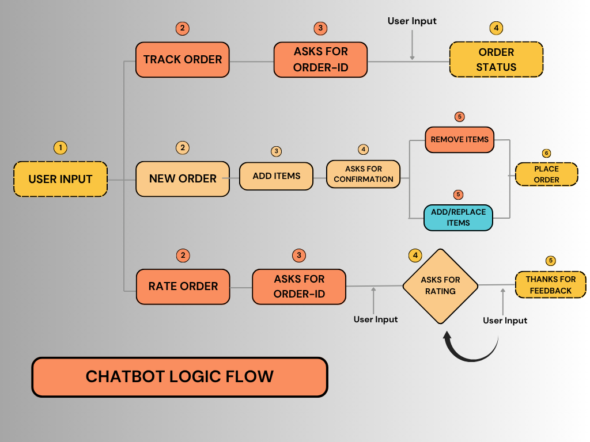

# 🍕 Chatori Chatbot

**Your AI Food Assistant for Smart Ordering** 🤖

Chatori is an intelligent food ordering chatbot built with Google Dialogflow that helps users browse menus,place orders, track the status of their order, and rate them as well seamlessly. Designed for restaurants and food businesses to enhance customer experience through conversational AI.
The chatbot is integrated with Dummy Food & Co. website.

## 🌟 Features

- **Smart Menu Navigation** - Browse through food categories and items with natural language
- **Order Management** - Place, modify, track, and rate orders through conversation
- **Real-time Interaction** - Instant responses with contextual understanding
- **Database Management** - Pulls data from MySQL and make edits according to different operations.

## 🚀 Demo

### Screenshots

*Homepage with Chatori integration*

*adding order*

*tracking order*

*rating order*

## 🏗️ Architecture

### System Flow

*Complete system architecture*

### Chatbot Logic Flow

*Detailed flowchart of chatbot conversation logic*

## 🛠️ Tech Stack

- **Frontend**: HTML5, CSS3 (Jinja2 templating via FastAPI)
- **Chatbot Platform**: Google Dialogflow ES
- **Backend**: Python 3.12, FastAPI
- **Database**: MySQL (hosted on Clever Cloud)
- **Deployment**:
  - Backend/API: Render
  - Database: Clever Cloud (Free MySQL plan)

## 💬 Project Features

- **🤖 Smart Greeting & Onboarding** : Initial user interaction
- **📋 Menu Browsing** : Food category and item exploration
- **🛒 Order Placement via Chat** : Complete order processing
- **⭐ Intelligent Rating System**:- AI-powered food rating
- **📦 Order Tracking & Updates** : Status updates and modifications

## 📚 What I Learned
- **✅ Dialogflow Integration** : Learned to design and manage chatbot intents, contexts, and entity extraction for real-time user interactions.
- **✅ Backend Development with FastAPI** : Understood how to handle webhook calls, serve dynamic templates using Jinja2, and build modular backend logic.
- **✅ Database Operations with MySQL** : data modeling for chatbot logic (orders, ratings, etc.).
- **✅ Cloud Deployment on Render & Clever Cloud** : Gained experience in deploying project and connecting external managed MySQL databases securely.

## ⚙️ Optimization Techniques Implemented
- **🕒 Timezone & Timestamp Handling** : handling Dialogflow 5s time-out window by asyncing data retrieval and data editing operations in time-gap
- **📶 Retry & Fallback Handling in Dialogflow** : Handled unexpected user inputs using fallback intents, preventing logic breakage.

#### **Link to the website** : https://chatori-chatbot.onrender.com
#### ~ Developed by Siddharth Angra